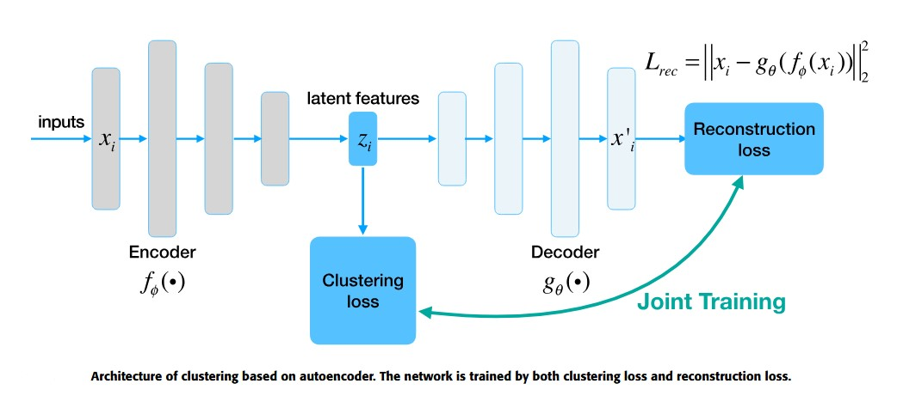
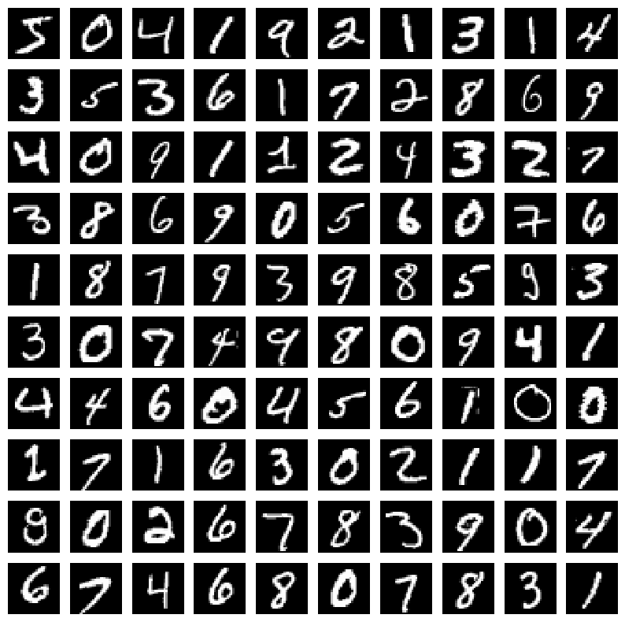
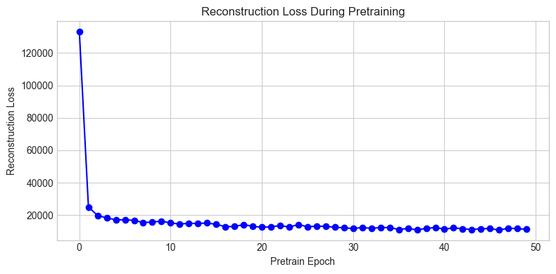
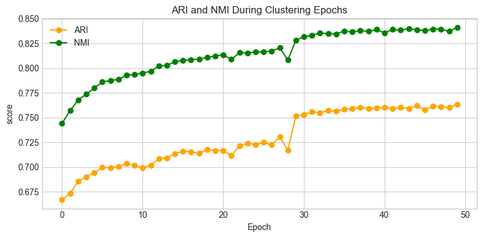
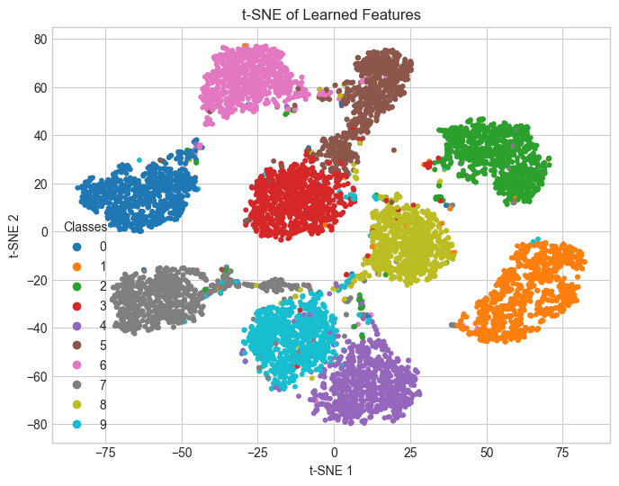

## DCN: Deep Clustering Network

This repository contains a PyTorch implementation of the paper:

"Towards K-means-friendly Spaces: Simultaneous Deep Learning and Clustering"
Jianbo Yang, Devin M. Kaufman, Jinsung Yoon, and Mihaela van der Schaar,
[original paper](https://arxiv.org/pdf/1610.04794.pdf)

The code is originally from : [@xuyxu](https://github.com/xuyxu/Deep-Clustering-Network/) and [@guenthereder](https://github.com/guenthereder/Deep-Clustering-Network)

I have merged the code in a jupyter notebook and added some minor changes. 

### Overview

Deep Clustering Network (DCN) is a method that jointly optimizes a deep autoencoder and K-means clustering objective. The goal is to learn a feature space where K-means performs well, combining representation learning and clustering in a unified framework.

[image credits](https://ieeexplore.ieee.org/abstract/document/8412085). 

This implementation includes:

* A configurable deep autoencoder

* Joint training with K-means loss

* Evaluation metrics: **NMI** and **ARI**

* Comparisons with vanilla K-means (on raw data and autoencoder features)

### Install requirements

* Scikit-learn:

`pip install -U scikit-learn`

* Pytorch:

`pip install torch torchvision` (without CUDA) or 

`pip install torch torchvision --index-url https://download.pytorch.org/whl/cu126` (with CUDA 12.6)

* Pandas and Matplot:

`pip install pandas` , `pip install matplotlib `

### Experiment

#### Dataset

The dataset used for the experiments is the [mnist dataset](https://docs.pytorch.org/vision/main/generated/torchvision.datasets.MNIST.html):

#### Pre-training 

The reconstruction loss:

#### Training

The ARI and NMI scores during the training:

#### Test 

The ARI, NMI, ACC scores on the test set: 

| NMI | ARI | ACC |
|-----|-----|------------|
|84.22|75.76|83.34|

On the [original paper](https://arxiv.org/pdf/1610.04794.pdf):

| NMI  | ARI  | ACC  |
|------|------|------|
| 81.- | 75.- | 83.- |

The ARI, NMI, ACC scores of the vanilla Kmeans: 

| NMI   | ARI   | ACC   |
|-------|-------|-------|
| 43.01 | 39.89 | 49.00 |

### Visualisation of the feature latent space

